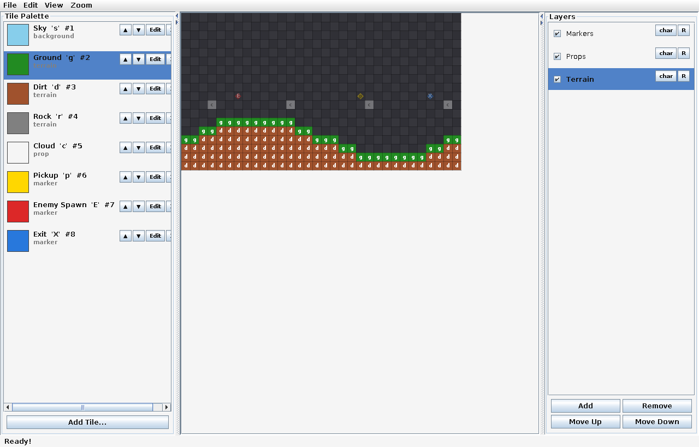

# Tile Map Editor

A desktop tile map editor built from scratch in **Java** using only the standard library (AWT/Swing). No game engine, no build tool, no third-party dependencies — every import is `java.*` or `javax.*`.

It exists to solve a specific problem: hand-typing 2D level arrays is miserable. Paint a map visually across multiple layers, then export each layer as a ready-to-paste Java `char[][]` or `int[][]` literal.

Originally built as a companion tool for a [2D action-platformer](https://github.com/Deleted-Usr/Java_Platformer) written in Java, but it has no dependency on that project and is useful for any game that stores levels as character grids.



---

## Table of Contents

- [Features](#features)
- [Getting Started](#getting-started)
- [Controls](#controls)
- [How It Works](#how-it-works)
  - [Tile Palette](#tile-palette)
  - [Layers](#layers)
  - [Layer Restrictions](#layer-restrictions)
- [Export Format](#export-format)
- [Import](#import)
- [Palette Files](#palette-files)
- [Architecture](#architecture)
- [Testing](#testing)
- [Roadmap](#roadmap)
- [Notes](#notes)

---

## Features

- **Multi-layer painting** — any number of layers, each its own independent character grid, drawn back-to-front with inactive layers dimmed so you can see context without losing focus.
- **Configurable palette** — every tile has a letter, display name, category, numeric id, fallback colour, and optional sprite loaded from disk.
- **Dual export formats** — each layer exports as `char[][]` or `int[][]`, toggled per layer, so grids that want readable letters and grids that want numeric ids can live in the same map.
- **Generated loader code** — props and markers export as a ready-made `switch` loop that populates a list of objects, not just raw data.
- **Round-trip import** — paste existing Java arrays back in and keep editing. Tolerates comments, trailing commas, quoted and compact rows, and both Java and C-style declarations.
- **Full undo/redo** — a mouse drag is one undo step, and structural changes (resize, fill, import, layer add/remove) snapshot the whole model.
- **Portable palettes** — save the whole palette, sprites included, to a single self-contained file.
- **Light and dark themes**, a toggleable grid, letter overlays, and zoom.

---

## Getting Started

**Requirements:** JDK 21 or newer. Nothing else.

```bash
# Compile
javac -d out $(find src -name "*.java")

# Run
java -cp out com.willclay.mapeditor.Main
```

In an IDE, mark `src` as the source root and set the run configuration's main class to `com.willclay.mapeditor.Main`.

---

## Controls

| Input | Action |
|-------|--------|
| Left mouse (click / drag) | Paint the selected tile onto the active layer |
| Right mouse (click / drag) | Erase |
| `Ctrl` + scroll wheel | Zoom in / out |
| Scroll wheel | Scroll the canvas |
| `Ctrl` / `Cmd` + `Z` | Undo |
| `Ctrl` / `Cmd` + `Y` | Redo |

Clicking a palette row selects that tile. Clicking a layer row makes it the active paint target. Fill, clear, resize, zoom and the view toggles all live in the menu bar.

---

## How It Works

### Tile Palette

A tile definition is the link between a character in the grid and what it means:

| Field | Purpose |
|-------|---------|
| **Letter** | The character written into the grid. This is what ends up in your exported array. |
| **Name** | Human-readable label, also used as the type string in generated loader code. |
| **Category** | `Background`, `Terrain`, `Prop` or `Marker`. Only Prop and Marker tiles generate loader snippets. |
| **ID** | The number written into `int[][]` layers. `0` is reserved for empty. |
| **Colour** | Fallback fill drawn when no sprite is set. |
| **Sprite** | Optional image, drawn nearest-neighbour so pixel art stays crisp. |
| **Layer** | Optional restriction — see below. |

Markers draw as a diamond rather than a filled square, so gameplay triggers stay visually distinct from solid terrain.

### Layers

Every layer is a `char[][]` internally, regardless of how it exports. A layer can be:

- **Reordered** — layers draw back-to-front, so order is paint order.
- **Hidden** — untick its checkbox to get it out of the way.
- **Renamed** — the export variable name follows the layer name.
- **Retyped** — toggle between `char` and `int` export with the button on its row.

### Layer Restrictions

By default a letter must be unique across the whole palette. Pin a tile to a specific layer and that letter becomes free for reuse on other layers.

This matters because grids are usually authored per-purpose. A terrain grid and a props grid are separate spaces, so `'a'` can mean *Rock Plain* on terrain and *Sign With Arrow* on props with no ambiguity. The editor enforces the rule that makes this safe: tiles may share a letter **only** when every one of them is pinned to a different layer. An unrestricted tile would collide everywhere, so it's rejected.

---

## Export Format

Export produces two independent sections, each copyable on its own.

**1. Map data** — one array per layer:

```java
// Generated by Tile Map Editor
// Map Size: 6 cols x 3 rows, tile size: 16px

char[][] Terrain = {
    {' ',' ',' ',' ',' ',' '},
    {'g','g','g','g','g','g'},
    {'d','d','d','d','d','d'}
};

char[][] Props = {
    {' ','t',' ',' ',' ',' '},
    {' ',' ',' ',' ',' ',' '},
    {' ',' ',' ',' ',' ',' '}
};
```

Quoting is optional. Unquoted output gives you the compact `{gggggg}` form, which is far easier to read as a map at a glance — at the cost of not being able to represent an empty cell, since a literal space is indistinguishable from formatting.

An optional **name prefix** namespaces the variables (`level1_Terrain`) when several maps share a scope.

**2. Object loaders** — for layers containing Prop or Marker tiles — This prop-loading format is not deprecated in favour of loading props directly from the grids themselves: 

```java
List<Prop> propList = new ArrayList<>();
for (int row = 0; row < Props.length; row++)
{
    for (int col = 0; col < Props[row].length; col++)
    {
        switch (Props[row][col])
        {
            case 't' -> propList.add(new Prop("Torch", row, col));
        }
    }
}
```

The class name is derived from the layer name and singularised, so a layer called `Props` produces `Prop` objects into `propList`. Coordinates are passed as `(row, col)`, and the tile's name becomes the type string. This assumes a constructor or record of the shape `Prop(String type, int row, int col)` — adjust the generator in `io/LoaderExporter.java` if your types differ.

Layers holding only terrain are skipped, since raw grid data doesn't need a loader.

---

## Import

Paste Java source into the import dialog and every array declaration in it becomes a layer. **Preview** parses without applying, so you can confirm the detected layer count and dimensions first.

The parser handles:

- `char[][]` and `int[][]` declarations, Java (`char[][] name`) or C style (`char name[R][C]`).
- Quoted rows (`{'g','d'}`) and compact rows (`{gd}`).
- Line and block comments, trailing commas, and arbitrary whitespace.
- Bare initialisers with no declaration (`{ {...}, {...} }`).
- Ragged rows, padded to a uniform width and flagged in the confirmation.

Two options worth knowing:

- **Resize map to fit** grows the map to the largest imported layer instead of clipping to the current size.
- **Add unknown letters to palette** creates a neutral tile for any letter with no definition, so imported data is actually visible rather than rendering as unknown.

Importing an `int[][]` layer maps ids back to letters through the palette, so numeric grids stay editable as characters.

---

## Palette Files

Palettes save to a plain-text `.tmepal` file with sprites embedded as base64 PNG, so a palette is a single self-contained artifact you can commit or share without dragging image files along with it.

---

## Architecture

The split that matters: **nothing outside `ui` imports Swing.** The model, undo system and file formats are pure logic, which is what makes them testable without a display.

```
com.willclay.mapeditor
├── core/editor/          EditorModel - all editor state, no Swing
├── domain/               Layer, TileDef, ParsedLayer
├── history/              Undo/redo: stroke edits, snapshots, history stacks
├── io/                   Palette save/load, Java array import & export
├── ui/                   EditorFrame
│   ├── menu/             Menu bar + one action class per menu
│   ├── panels/           Canvas, palette and layer panels
│   ├── dialogs/          New/resize, tile, import, export dialogs
│   └── theme/            Light/dark theming
└── Main.java             Entry point
```

A few deliberate decisions:

- **`EditorModel` fires listeners on structural changes only** — new map, resize, layer add/remove. Individual cell edits don't, because painting would flood the UI with notifications; the canvas repaints itself directly instead.
- **Undo has two strategies.** Painting records only the cells that actually changed, so strokes stay cheap. Structural edits capture a before/after snapshot of the whole model, because tracking their deltas individually would be far more error-prone than copying a few grids.
- **Menu actions live in their own classes** (`FileMenuFunctions`, `EditMenuFunctions`, …) rather than as lambdas inside the menu bar, keeping the menu definition readable as a list of what the menu contains.

---

## Testing

`test/SmokeTest.java` is a dependency-free harness — no JUnit, no build tool:

```bash
javac -d out $(find src -name "*.java")
javac -cp out -d out test/SmokeTest.java
java -cp out SmokeTest
```

It covers the map lifecycle, stroke and snapshot undo/redo, fill and clear, resize in both directions, layer operations, the duplicate-letter rules, `char` and `int` export round trips, escaping, loader generation, palette save/load including an embedded sprite, and the importer's tolerance cases. It prints a pass/fail count and exits non-zero on failure.

---

## Roadmap

- Tileset support — slice a sheet and pick tiles from it instead of one sprite per tile.
- Rectangle, line and flood-fill tools.
- Copy/paste of grid regions.
- A recent-files list and remembering the last-used directory.
- Configurable keybindings.
- Export straight to a file the game reads at runtime, rather than pasting source.

---

## Notes

This was written as a learning exercise alongside the game it was built for. The Java array parser in `io/MapImporter.java` is hand-rolled rather than using a real grammar — it's tolerant of the formatting people actually paste, but it isn't a Java parser and doesn't pretend to be.

Sprites loaded into a palette remain the property of whoever made them; nothing is bundled with this tool.
